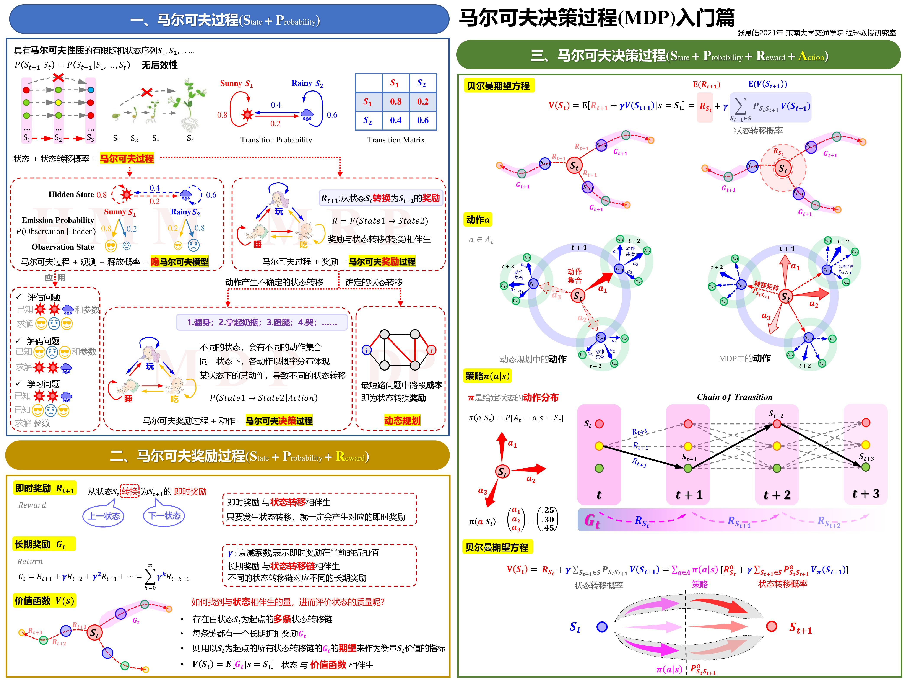

# RL Demo

## Markov 决策过程



[马尔可夫决策过程入门](https://www.bilibili.com/video/BV1mY411J7u9)

## 有模型RL求解：价值迭代

[价值迭代算法求解MDP马尔可夫决策过程](https://www.bilibili.com/video/BV18A411P7Lj)

## 有模型RL求解：策略迭代

[策略迭代算法求解MDP马尔可夫决策过程](https://www.bilibili.com/video/BV14f4y137Yh)

## 无模型RL求解：蒙特卡洛

[同策略和异策略下首次访问的蒙特卡罗算法仿真](https://www.bilibili.com/video/BV1kL411P768)

## TD算法

### SARSA算法（同策略：on-policy）

同策略：行动策略和评估策略一致

```
Q(S,A)←Q(S,A)+α[R+γQ(S',A')−Q(S,A)]
                a       a'
```

- `α`：学习率
- `γ`：gama折扣因子

#### 行动策略（Behavior Policy）
在 `Q(S, A)` 中如何选择动作 `a`(直接决定`R`是多少)，SARSA 采用 **ε-greedy** 方法：

1. 以概率 `ε ∈ (0, 1)` **随机**选择一个动作（探索）。  
2. 以概率 `1−ε` 选择当前 `Q(S, A)` 估值最高的动作  
   `a* = argmaxₐ Q(S, A)`（利用）。

> 例子：ε = 0.1 时，10% 概率随机挑路，90% 概率走已知最快路线，既保持好奇又偏向最优。

#### 评估策略（Target Policy）
在`Q(S',A')`中如何选择动作`a'`，SARSA 的评估策略与行动策略**相同**，即 **同策略（on-policy）**，依旧使用 ε-greedy。

### Q-Learning（异策略：off-policy）

异策略：行动策略和评估策略不一致

```
Q(S,A)←Q(S,A)+α[R+γ max Q(S',A')−Q(S,A)]
                a            a'
```

- `α`：学习率
- `γ`：gama折扣因子

#### 行动策略（Behavior Policy）
在 `Q(S, A)` 中如何选择动作 `a`(直接决定`R`是多少)，Q-Learning 采用 **ε-greedy** 方法（还可使用其他任意探索策略）：

1. 以概率 `ε ∈ (0, 1)` **随机**选择一个动作（探索）。  
2. 以概率 `1−ε` 选择当前 `Q(S, A)` 估值最高的动作  
   `a* = argmaxₐ Q(S, A)`（利用）。

> 例子：ε = 0.1 时，10% 概率随机挑路，90% 概率走已知最快路线，既保持好奇又偏向最优。

#### 评估策略（Target Policy）
在`Q(S',A')`中如何选择动作`a'`，Q-Learning 的评估策略与行动策略**不同**，即 **异策略（off-policy）**，直接使用 **贪婪策略（greedy）**，选择使 `Q(S', A')` 最大的动作。

### SARSA vs Q-Learning 区别对比

| 对比项 | SARSA | Q-Learning |
| --- | --- | --- |
| **策略类型** | 同策略（on-policy） | 异策略（off-policy） |
| **更新公式** | `Q(S,A)←Q(S,A)+α[R+γQ(S',A')−Q(S,A)]` | `Q(S,A)←Q(S,A)+α[R+γ maxₐ Q(S',A')−Q(S,A)]` |
| **行动策略** | ε-greedy | ε-greedy |
| **评估策略** | ε-greedy（与行动策略相同） | 贪婪策略（选择最大Q值） |
| **收敛特性** | 收敛到接近最优策略 | 收敛到最优策略 |
| **风险偏好** | 保守，考虑探索风险 | 激进，假设最优行动 |
| **适用场景** | 需要考虑探索代价的环境 | 可以离线学习的环境 |